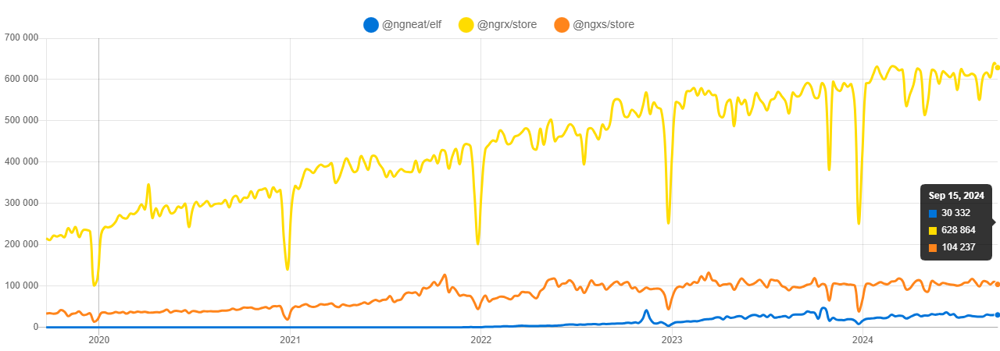
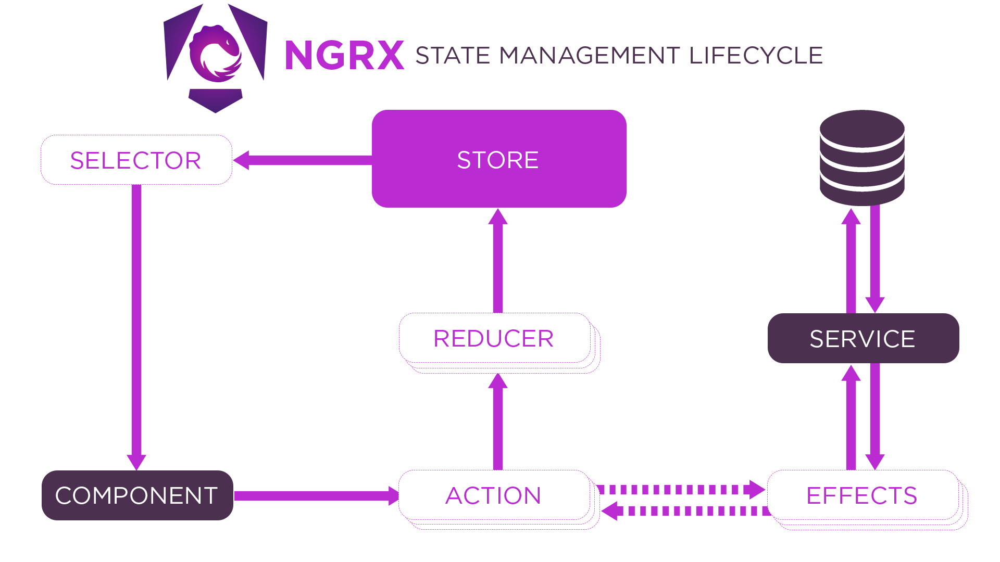
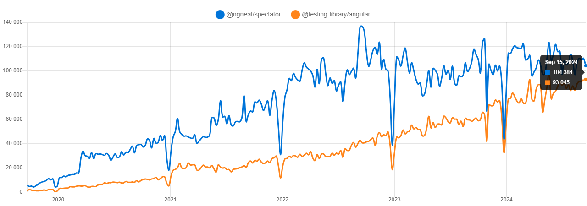
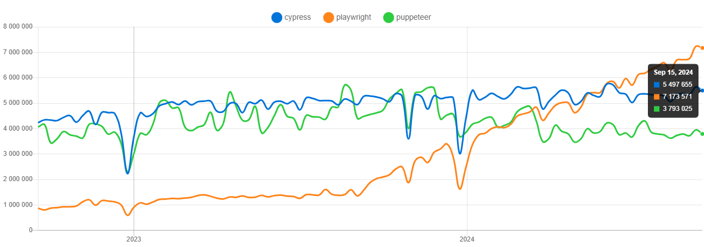

# Angular Workshop

## Grundläggande koncept

### Components
En Angular-applikation är uppbyggd av komponenter (visuellt sett). En komponent har följande innehåll:
- HTML (template)
- CSS (styling)
- Typescript (logik)
- Enhetstest (spec.ts)

### Services
En service används t.ex. för att tillhandahålla data. Vanligtvis sker serveranrop i en service. Man kan även använda services för att dela data mellan komponenter. Mer om det under state management.

### Directives
Ett directive är en instruktion som talar om för Angular hur en del av en webbsida ska se ut eller bete sig. Exempel på direktiv är `ngIf` och `ngFor`.

```html
<div *ngIf="showMessage">Hello, world!</div>

<ul>
  <li *ngFor="let item of items">{{ item }}</li>
</ul>
```

### Pipes
Pipes används för att transformera data. T.ex. `uppercase` och `date`.

```html
<p>{{ message | uppercase }}</p>
<p>{{ date | date: 'yyyy-MM-dd' }}</p>
```

### Modules
En modul är en samling av components, services, directives och pipes som hör ihop.

### Routing
Man kan hantera all navigering i en Angular-applikation utan routing. Vill man göra det för att t.ex. kunna kopiera länkar etc. finns det inbyggt stöd för det m.h.a. en router.

---

### Dependency Injection
Angular använder dependency injection och löser det i bakgrunden.
+ Lättare att skriva tester
+ Lättare att återanvända kod

---

### Forms
Det finns två sätt att hantera formulär i Angular.
1. Template-driven forms: fokuserar på att skapa formulär i HTML med validering i HTML-koden.

```html
<form #form="ngForm" (ngSubmit)="onSubmit(form)">
  <input type="text" name="name" ngModel required>
  <input type="email" name="email" ngModel required email>
  <button type="submit">Submit</button>
```
2. Reactive forms: fokuserar på att skapa formulär programmatiskt med validering i Typescript.
```typescript
this.form = this.fb.group({
  name: ['', Validators.required],
  email: ['', [Validators.required, Validators.email]],
});
```

```html
<form [formGroup]="form" (ngSubmit)="onSubmit()">
  <input formControlName="name">
  <input formControlName="email">
  <button type="submit">Submit</button>
```
Fördelen med reactive forms är att de är mer flexibla och lättare att testa etc.

---

### Observables
Angular använder sig av observables för att hantera asynkrona operationer. Går att jämföra med Promises.

Konventionen är att skriva `$` efter variabelnamnet för att indikera att det är en observable.

T.ex. httpClient.get() returnerar en observable, inte ett värde. Detta sker mha rxjs.

```typescript
import {Observable} from "rxjs";
import {DestroyRef, inject} from '@angular/core';

export class MessageService implements OnDestroy {
  constructor(private httpClient: HttpClient) {
  }
  
  destroyedRef = inject(DestroyRef);
  
  someFunction() {
    let getData$ = this.httpClient.get('https://httpbin.org/get')

    getData$
      .pipe(takeUntilDestroyed(this.destroyedRef))
      .subscribe(data => {
        console.log(data);
      });
  }
}

```

**HEADS UP!** Varje gång man skriver `subscribe` så skapas en ny prenumeration. Det är viktigt att stänga för att undvika minnesläckor! Några sätt att undvika minnesläckor:
- `takeUntilDestroyed()` (se ovan)
- `async` pipe i en HTML template
```html
<div *ngIf="getData$ | async as getData; else loading">
  {{ getData }}
</div>
<ng-template #loading>
  Loading stuff...
</ng-template>
```
`<ng-template>` är som en "div" som inte hamnar i DOM:en.
- Använda `unsubscribe()` i `ngOnDestroy()`

```typescript
export class MessageService implements OnDestroy {
  getDataSubscription: Subscription;

  ngOnInit() {
    this.getDataSubscription = this.httpClient.get('https://httpbin.org/get')
      .subscribe(data => {
        console.log(data);
      });
  }

  ngOnDestroy() {
    this.getDataSubscription.unsubscribe();
  }
}
```

Försök använda `async` pipe så mycket som möjligt. Det är enklare och blir mer sällan fel.

---

### Signals
```typescript
const count: WritableSignal<number> = signal(0);
const doubleCount: Signal<number> = computed(() => count() * 2);

// ...

count.set(1);
doubleCount.set(4); // kompileringsfel, eftersom den inte är writable
```
https://angular.dev/guide/signals

Signals är ett komplement (ej ersättare) till observables.

Mycket verkar vara i sin linda vad gäller hjälpfunktioner som t.ex. `observable$.toSignal()` osv.
https://angular.dev/guide/signals/rxjs-interop

---

### Schematics
Använd Angular CLI för att generera kod, t.ex. `ng generate component user` eller `ng generate service`:
```
$ ng generate component user
CREATE src/app/user/user.component.html (20 bytes)
CREATE src/app/user/user.component.spec.ts (601 bytes)
CREATE src/app/user/user.component.ts (238 bytes)
CREATE src/app/user/user.component.css (0 bytes)
```

---

## State management
Konsultsvaret: Det beror på...

- För mindre applikationer: använd services med `BehaviorSubject` för att dela data.
- För större applikationer: använd en state management-lösning.

### BehaviorSubject

```typescript
import {DestroyRef, inject} from '@angular/core';

export class DataService {
  private messageSubject = new BehaviorSubject<string>('Hello, world!');
  message$ = this.messageSubject.asObservable();

  destroyedRef = inject(DestroyRef);
  
  updateMessage() {
    httpClient.get('https://httpbin.org/get')
      .pipe(takeUntilDestroyed(this.destroyedRef))
      .subscribe(data => {
        this.messageSubject.next(data);
      });
  }
}

@Component({
  selector: 'app-root',
  template: `
    <div>{{ message$ | async }}</div>
    <button (click)="setMessage('Hello, Angular!')">Change message</button>
  `
})
export class AppComponent {
  constructor(private dataService: DataService) {}
  
  message$ = this.dataService.message$;

  updateMessage() {
    this.dataService.updateMessage();
  }
}
```
Notera pipe `async` som används för att prenumerera på en observable i en template.

### Redux
Redux-mönstret handlar om att centralisera state, vilket gör applikationen mer:
+ förutsägbar och lättestad
+ överskådlig
+ debug-vänlig (lätt att förstå varför något ser ut som det gör)

Redux finns för JavaScript i "vaniljformat" och har även en React-Redux-variant.

I Angular finns flera varianter. T.ex.:
- NgRx
- NgXS
- Elf


https://npmtrends.com/@ngneat/elf-vs-@ngrx/store-vs-@ngxs/store

Kan ej uttala mig om NgXS eller Elf, men NgRx är stabilt. Har en viss inlärningskurva och det blir viss boilerplate. NgXS säger sig råda bot på detta.

### Redux DevTools
Använd! Blir otroligt mycket enklare att felsöka, göra "time travel" etc. Ska funka till samtliga exempel ovan.
- [Chrome-tillägg](https://chrome.google.com/webstore/detail/redux-devtools/lmhkpmbekcpmknklioeibfkpmmfibljd)
- [Firefox-tillägg](https://addons.mozilla.org/en-US/firefox/addon/reduxdevtools/)

### NgRx

---

https://ngrx.io/guide/store
---

Grundläggande koncept:
- Store: centraliserat state
```typescript
import { createFeatureSelector, createSelector } from '@ngrx/store';

export interface AppState {
  user: UserState;
}

export interface UserState {
  name: string | null;
  age: number | null;
}
```
- Selectors: hämtar data från store

```typescript
import {AppState} from './app.state';
import {setName} from './user.actions';

@Component({
  selector: 'app-user',
  template: `<div *ngIf="user$ | async as user">{{ user.name }}: {{ user.age }}</div>`
})
export class UserComponent {
  user$ = this.store.select(selectUser);

  constructor(private store: Store<AppState>) {
  }
  
  changeNameTo(name: string) {
    this.store.dispatch(setName({ name }));
  }
}
```
- Actions: beskriver vad som händer
```typescript
import { createAction, props } from '@ngrx/store';
import { UserState } from './user.state';

export const UserActions = createActionGroup({
  source: 'User',
  events: {
    'Set Name': props<{name: string}>(),
  }
});
```
- Reducers: beskriver hur state förändras, hanterar actions
```typescript
import { createReducer, on } from '@ngrx/store';
import { setName } from './user.actions';

export const initialState: UserState = {
  name: null,
  age: null
};
export const userReducer = createReducer(
  initialState,
  on(setName, (state, { name }) => ({ ...state, name }))
);
```
- Effects: hanterar asynkrona operationer (sidoeffekter) baserat på actions
```typescript
import { Injectable } from '@angular/core';
import { Actions, createEffect, ofType } from '@ngrx/effects';
import { HttpClient } from '@angular/common/http';
import { switchMap } from 'rxjs/operators';
import { setName } from './user.actions';

@Injectable()
export class UserEffects {
  setName$ = createEffect(() => this.actions$.pipe(
    ofType(setName),
    switchMap(({ name }) => this.httpClient.get(`https://httpbin.org/get?name=${name}`))
  ));

  constructor(private actions$: Actions, private httpClient: HttpClient) {}
}
```

---

### NgRx Schematics
Generera NgRx-kod med schematics:

`$ ng add @ngrx/schematics@latest`


---

## Test
### Enhetstester: Karma, Jasmine -> Jest + Testing Library


https://npmtrends.com/@ngneat/spectator-vs-@testing-library/angular

#### Testa observables
```typescript

import { TestScheduler } from 'rxjs/testing';

let scheduler: TestScheduler;

beforeEach(()=>{
  scheduler = new TestScheduler((actual, expected) => {
    expect(actual).toEqual(expected)
  })
})

it('should filter even numbers and multiply each number by 10', () => {
  
  scheduler.run(({cold, expectObservable}) => {
    const sourceValues = { a: 1, b: 2, c: 3, d: 4, e: 5, f: 6, g: 7, h: 8, i: 9, j: 10};

    const source$ = cold('-a-b-c-d-e-f-g-h-i-j|', sourceValues);
    const expectedOrder = '-a---b---c---d---e--|';
    const expectedValues = { a: 10, b: 30, c: 50, d: 70, e: 90};
    
    const result$ = source$.pipe(
      filter(n => n % 2 !== 0),
      map(x => x * 10)
    );

    expectObservable(result$).toBe(expectedOrder, expectedValues);
  })
});
```

```typescript
import { subscribeSpyTo } from '@hirez_io/observer-spy';

it('should filter even numbers and multiply each number by 10', () => {
  
    const result$ = of(1, 2, 3, 4, 5, 6, 7, 8, 9, 10).pipe(
      filter(n => n % 2 !== 0),
      map(x => x * 10)
    );

    const observerSpy = subscribeSpyTo(result$);

    expect(observerSpy.getValues()).toEqual([10, 30, 50, 70, 90]);

  })
});
```

https://github.com/hirezio/observer-spy

Verkar som att TypeScript-versionen inte uppdaterats dock. Man kan överväga om det finns alternativ eller om man ska lägga en PR.

### End-to-end: Protractor (deprecated) -> Cypress/(Playwright?)


https://npmtrends.com/cypress-vs-playwright-vs-puppeteer

## Tips

### Filstruktur
Tyckte det här verkar ganska rimligt om man vill ha en bra struktur: https://dev.to/vixero/a-simple-angular-folder-structure-that-makes-development-feel-natural-and-easy-241d
